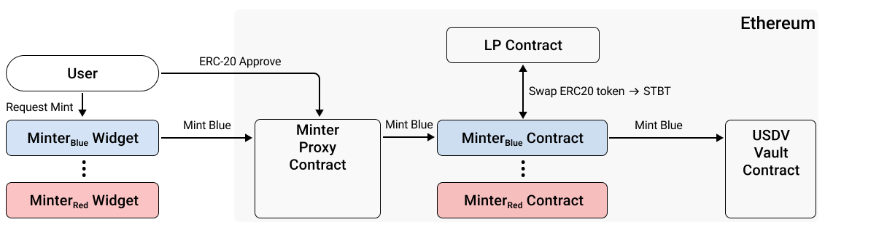

# Minter Widget

Minter Widget is a frontend tool to facilitate minting USDV with alternative stablecoins (e.g. USDC/USDT/DAI) should the minter choose to support it.&#x20;

The minter can configure the Minter Widget with its own registered color and all newly minted USDV through this widget will be colored accordingly.

The Widget supports [Minter.sol](on-ethereum.md#default-minter.sol) (via MinterProxy) on Ethereum and [BridgeRecolor.sol](on-sidechain/#default-bridgerecolor.sol) on Sidechains.

## Architecture (Ethereum)

<figure><figcaption><p>The minter widget allows users to easily interact with minter contracts. For security, users should only ever interact with the Minter proxy contract, which routes their mint requests to the correct Minter contract.</p></figcaption></figure>

### Deploy Widget

Here is an example of how to deploy a minter widget on your website with the React framework.

1. Add `@usdv/usdv-widget` to the dependencies of your package.

```
yarn add @usdv/usdv-widget
```

or

```
 npm install @usdv/usdv-widget
```

2. In your page file

```
import {bootstrapWidget} from '@usdv/usdv-widget';

bootstrapWidget({color: 5});
```

3. declare elements in html or jsx file. `usdv-tracker`、`usdv-bridge`、`usdv-mint` and `usdv-widget` are custom HTML elements. `usdv-tracker` is used for displaying transaction status, `usdv-bridge` is used for transferring across chains, and `usdv-mint` is used for minting. `usdv-widget` is a combination of the above three elements.

```
<!-- DO NOT USE SELF CLOSING TAGS -->
<div className="center">
    <usdv-widget style="padding: 20px"></usdv-widget>
</div>
```

or if you only want mint feature with transaction tracker, you can use it like this:

```
<!-- DO NOT USE SELF CLOSING TAGS -->
<div className="center">
    <usdv-tracker style="width:468px;margin-bottom: 10px"></usdv-tracker>
    <usdv-mint style="padding: 20px"></usdv-mint>
</div>
```

4. Also, you can customize the theme of the widget.

```
import {bootstrapWidget, themes} from '@usdv/usdv-widget';
bootstrapWidget({color: 5, theme: themes.dark});
```

### Request Mint

This is the interface to mint USDV :

```
    function mint(
        address _token, // must be whitelisted assets like STBT
        address _receiver, // receiver of the minted USDV
        uint64 _usdvAmount, // target USDV amount to mint
        uint32 _color, // color of the USDV
        bytes32 _memo // a reserved field to record meaning extra data for mint
    ) public {}
```

Widget can also provide a minting memo for this minting action for extensibility, such as keeping record or external attributions.
