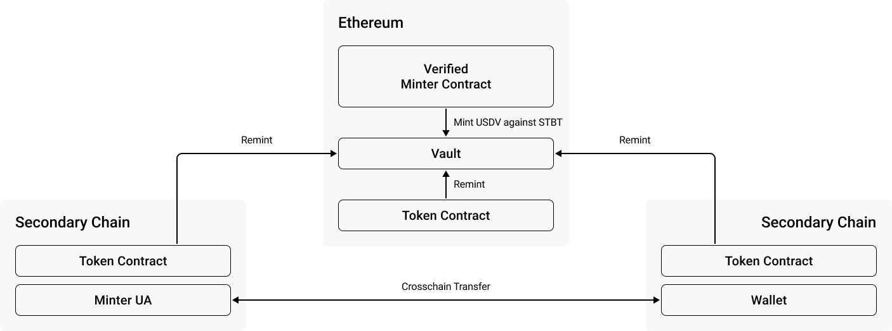

# USDV Architecture

## Overview

<figure><figcaption>
USDV contract interactions.
</figcaption></figure>

* Verified Minter Contracts can mint USDV using STBT as collateral.
* Token contracts on any USDV-enabled blockchain can send [remint](remint.md) requests to the vault to atomically burn-and-swap USDV from one color to another.&#x20;
* Tokens are freely transferred between wallets within or between blockchains.

## Vault

All tokenized assets and generated yields are stored in a globally unique **Vault** on **Ethereum**, the most secure and decentralized L1 chain on the market.

The Vault **issues, tracks, and updates** the _mint_ of each color. The mint of each color is the sum of circulation for a given color across all chains.&#x20;

This mint is used to calculate the contribution of a given color to the global circulation across all blockchains, which is used to calculate yield shares.&#x20;

After USDV is minted in the Vault, it is atomically transferred to the Minter’s wallet on the primary chain, from where it can be transferred to other chains or wallets.

## USDV

USDV contracts are compatible with the widely adopted token standards (e.g. ERC20 on EVM) with administrative features for compliance requirements. It will also include signature-based permit (EIP2612) interfaces on EVM chains.&#x20;

Each USDV contract manages local coloring state. The coloring information will be synchronised back to the Vault to reduce the divergence for proper attribution.

USDV is deployed omnichain. Learn more about contract roles & functions at [**Contract Governance**](../technical-reference/contract-governance.md).

### Crosschain

USDV is built on the omnichain messaging protocol LayerZero; we chose LayerZero due to its superior immutable security, permissionless design, and censorship resistance.

## Minter

A Minter Contract is deployed for each (new) Verified Minter, and facilitates the coloring of tokens, minting using alternative stablecoins, blacklisting/whitelisting, and more.&#x20;

For easy integration, please refer to [**Minter Widget**](../app-integrations/minter-widget.md).
