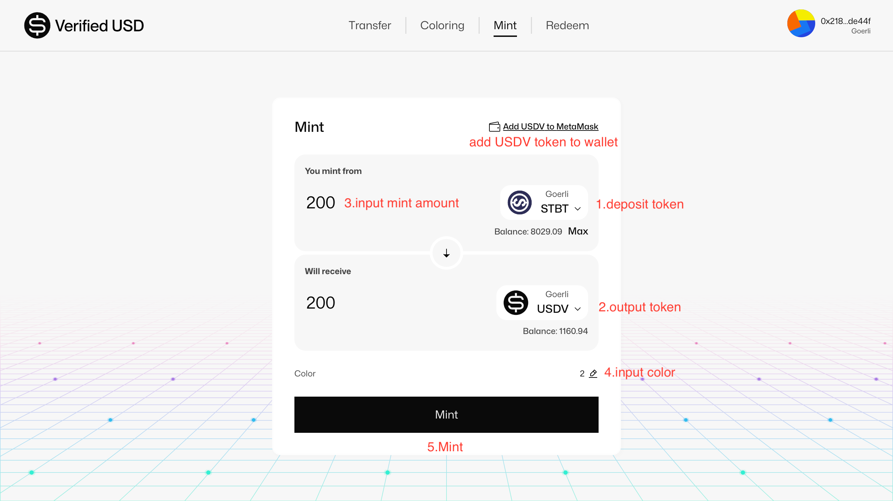
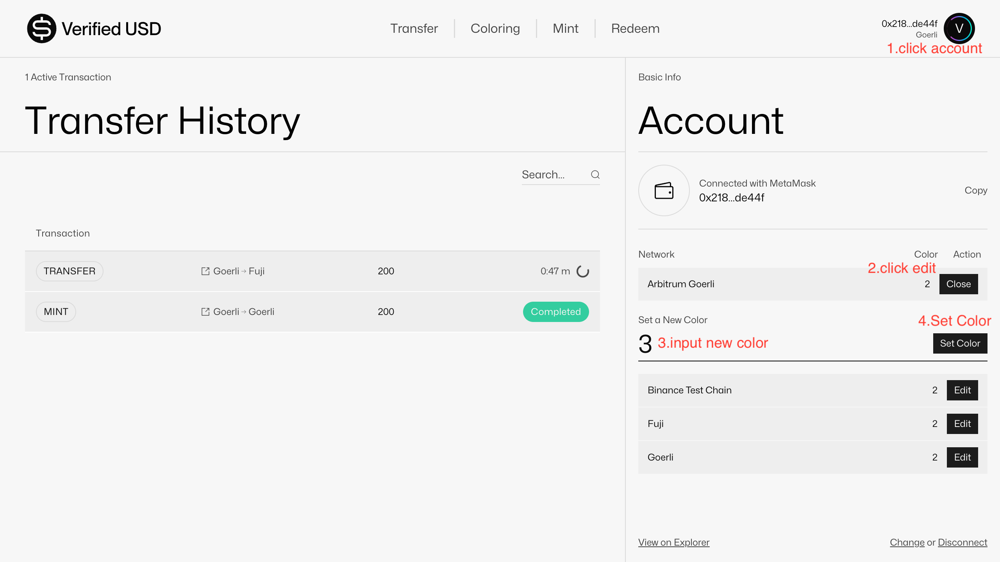

# Minter

## How to deploy a `Minter` contract to support swapping from USDC/USDT/DAI to USDV with your color?

Ask the `Verified USD Foundation` team, please.

## How to mint USDV from STBT?

## How to transfer USDV?

## How to redeem USDV to STBT?

## How to sync delta?

## How to remint?

## How to withdraw rewards?

## How to set colour?

