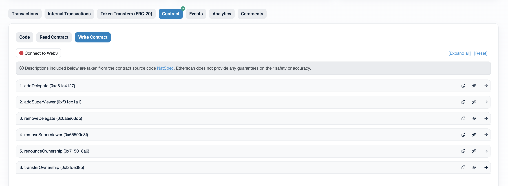

# Mint

After successfully connecting to your whitelisted wallet, you will notice that **‘Mint’** and **‘Redeem’** functions are unlocked.

<figure><figcaption></figcaption></figure>

Navigate to the **'Mint'** page. The **'Mint'** engine is built upon the standard swap interface.

You can mint USDV by supplying STBT. Enter the supply amount. Supply and mint are on a 1:1 basis.

## Set Colour

An important feature of USDV is ColourTrace. Minters can mint their USDV in any of the circulating colours. If you are a ‘Verified Minter’, the default colour will be your assigned colour. Here, our default (and assigned) colour is 14.

<figure><figcaption></figcaption></figure>

Click on the pen icon to change your choice of colour. Colours are recorded as unique positive integers. The number of colours is capped by the number of ‘Verified Minters’ in the USDV ecosystem.

<figure><figcaption></figcaption></figure>

Click the **‘Mint’** button to initiate the transaction. You will be asked to confirm the transaction in your wallet. Click **‘Confirm’** to proceed.

<figure><figcaption></figcaption></figure>

After successful confirmation, the transaction will be submitted. USDV will be sent to your wallet directly.

<figure><figcaption></figcaption></figure>

## Import USDV to your wallet

After minting USDV, remember to import them to your wallet by clicking ‘Add USDV to Wallet’ so USDV is properly revealed in your wallet.

<figure><figcaption></figcaption></figure>

Click which chain you want USDV to be imported. Confirm **‘Add Token’** on your wallet to complete USDV import.

<figure><figcaption></figcaption></figure>
