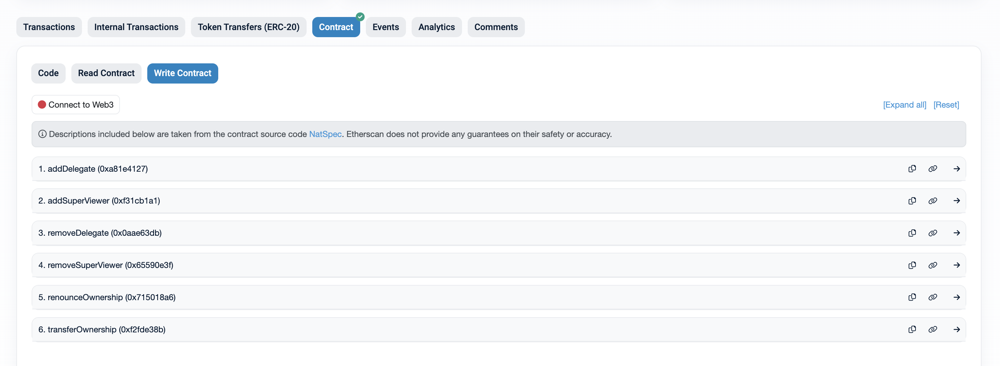

# Delegating Viewers

Verified Minters may choose to delegate viewing to other addresses, granting them access to all the app features (i.e Coloring and Transfer). Delegated addresses can monitor, color and transfer USDV on Verified Minter's behalf.

First, visit the [**ViewDelegate contract on Etherscan**](https://etherscan.io/address/0x7da4b01D014a02d92637bD27118f7da3b3DAaA17)**.** Click **'Contract'** then **'Write Contract'**.

<figure><figcaption></figcaption></figure>

Click **'Connect to Web3'** and connect to your wallet. Make sure this is the whitelisted wallet approved by KYC (Verified Minter).

## Add Delegate

Verified Minters can delegate viewing to any address provided it is under their own unique color ID.&#x20;

In the case that the Color ID requested is different from the one owned by the connected Verified Minter wallet, the delegation will be rejected.

<figure><figcaption></figcaption></figure>

## Remove Delegate

Verified Minters may remove delegated addresses following a similar process, by providing Verified Minter's unique color ID and the delegated address.&#x20;

**Note: Verified Minters should maintain a record of all delegated addresses to ensure traceability and that the right users are granted viewing access.**

<figure><figcaption></figcaption></figure>
