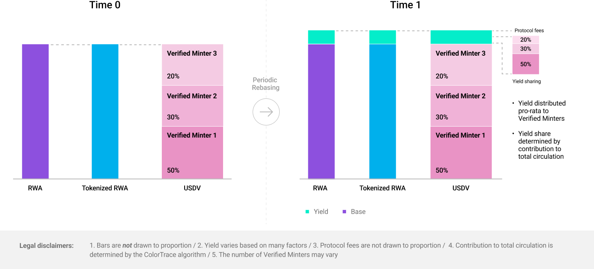

# Yield & Peg Management

USDV is built upon tokenized Real World Assets (Tokenized RWA), which are 100% backed by cash and yield bearing, highly liquid, risk-free financial instruments (i.e repos, short term T-bills).

Only whitelisted tokenized assets are permitted to be underlying assets of USDV. All tokenized assets are stored in a [Vault](broken-reference) on Ethereum.

**STBT (Short-term Treasury Bill Token) is the first reserve asset underlying USDV.**

## STBT (Short-term Treasury Bill Token)

Exclusively designed for accredited investors, STBT follows ERC-1400 standards, allowing holders to tap into risk-free US T-bill yields. Yield is rebased to holders' STBT balances on a daily basis.

STBT is pegged 1:1 to USD, fully backed by the US dollar and US Treasury securities with maturities within 6 months and reverse repurchase agreements.

STBT is issued by Matrixdock, a digital asset platform that provides access to Real World Assets (RWA) through tokenization, a brand fully owned by Matrixport.

Website: [https://stbt.matrixdock.com/](https://stbt.matrixdock.com/)

Proof of Reserve: [https://data.chain.link/ethereum/mainnet/reserves/stbt-](https://data.chain.link/ethereum/mainnet/reserves/stbt-por)

FAQ: [https://matrixdock.gitbook.io/matrixdock-docs/v/english/](https://matrixdock.gitbook.io/matrixdock-docs/v/english/)

## Underlying Tokenized RWA is always pegged 1:1 to US Dollar

For underlying Tokenized RWA (here, STBT) to maintain 1:1 peg with US Dollar, its total supply is adjusted to the Net Asset Value (NAV) of the underlying portfolio on a **daily basis.** Yield is then rebased, excluding any negative interest days.

(Rebase is where supply is **algorithmically adjusted to peg the price**. In our case, this is the minting of new tokens to ensure constant 1:1 peg to US Dollar)

USDV's [Vault](broken-reference) holding all the tokenized RWA will also receive the rebase yield.

<figure><figcaption>
Yield is proportionally shared between Verified Minters based on the circulation attribution calculated by ColorTrace.
</figcaption></figure>

### Fair, transparent and equitable yield distribution

Countless CeFi, DeFi and businesses across geographies, blockchains and domains will contribute to USDV circulation and its growth.

Logically, **players contributing to a greater share of USDV circulation should be eligible to a larger share of the underlying yields.**

Given the unpredictable and permissionless nature of stablecoin flow, the difficult question is **how can we attribute USDV circulation precisely to each contributor to enable fair yield distribution?**&#x20;

This is enabled by [**ColorTrace**](../concepts/coloring.md), a novel token coloring algorithm developed by LayerZero Labs, and a core feature supporting the USDV architecture.

